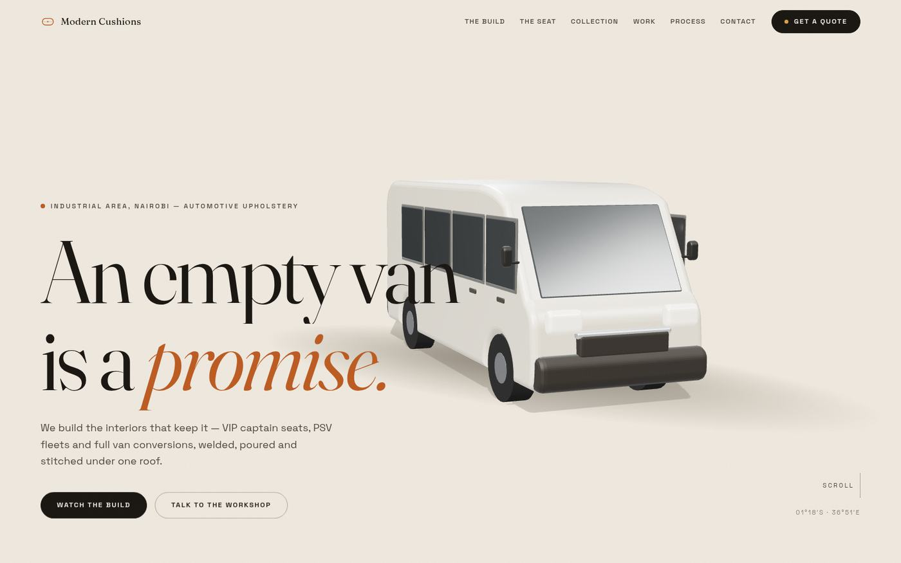
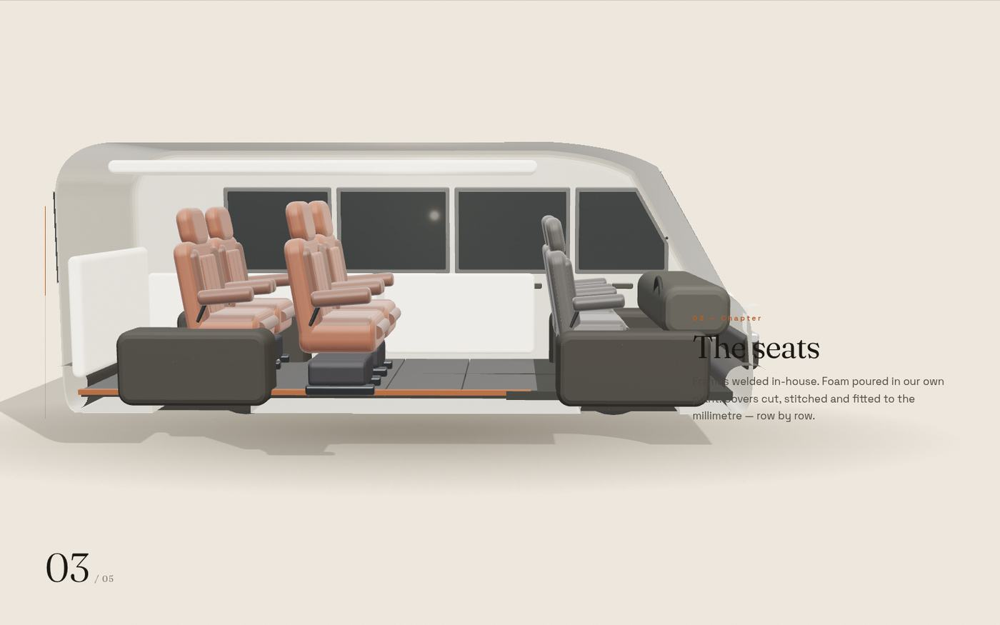
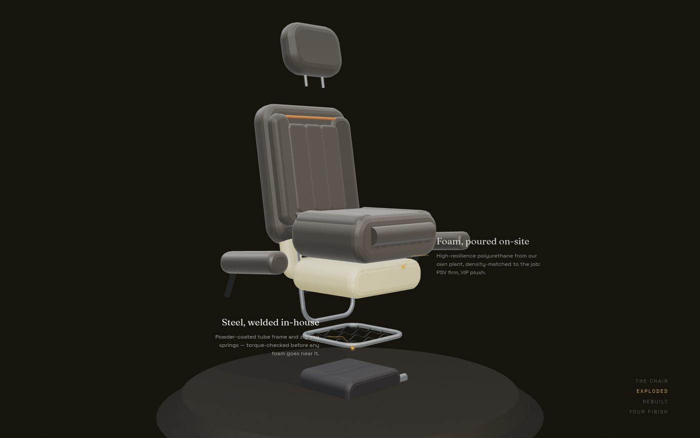

# Modern Cushions — moderncushions.co.ke

A scroll-driven 3D experience for Modern Cushions, an automotive upholstery
workshop at 64 Old Enterprise Road, Industrial Area, Nairobi.

The site opens on an **empty 3D van**. As you scroll, the van is furnished in
five chapters — floor, panels, seats row by row, starlit roof — then rolls out
finished. A second pinned scene takes one VIP captain seat apart layer by layer
(frame, poured foam, stitched cover, headrest) and lets visitors pick a fabric
finish live. Every photo on the page is the workshop's real work, including the
stadium dugouts they built for Nyayo National Stadium.





## Stack

- **Vite + TypeScript** — no framework; the page is one hand-orchestrated experience
- **three.js** — both vehicles are fully procedural (no model files): the van is an
  extruded body profile with a clipping-plane cutaway; the seat is a layered build
  (frame tubes, springs, foam, covers, piping) designed to explode
- **GSAP ScrollTrigger** — scroll-scrubbed timelines drive cameras, furnishing,
  the exploded view and the DOM chapters in perfect sync
- **Lenis** — smooth scrolling (disabled for `prefers-reduced-motion`)
- Self-hosted variable fonts: Fraunces + Space Grotesk

## Develop

```bash
npm install
npm run dev        # dev server
npm run build      # type-check + production build to dist/
npm run preview    # serve dist/
```

### Visual QA

Headless screenshot passes across all scroll positions (desktop + mobile):

```bash
npm run preview -- --port 4173 &
node scripts/shoot.mjs
node scripts/shoot-mobile.mjs
```

## Structure

```
index.html              page skeleton, all sections
src/main.ts             boot: DOM hydration, preloader, interactions
src/data/content.ts     ALL business content: seats + KES prices, FAQs,
                        testimonials, contact, chapter copy
src/three/van.ts        procedural van builder (+ furnishing parts)
src/three/seat.ts       procedural captain seat builder (explodable)
src/three/vanScene.ts   hero + journey choreography
src/three/seatScene.ts  seat showcase choreography + fabric swaps
src/styles/             design system (bone/ink/rust palette)
public/assets/photos/   optimised real workshop photos
```

Prices, phone numbers and copy live in `src/data/content.ts` — edit there,
nothing else needs touching. Quote CTAs deep-link into WhatsApp
(+254 736 564 564) with a pre-filled message per seat.

## Deploy

Static output — `npm run build`, then serve `dist/` from any host
(Vercel/Netlify: build command `npm run build`, output `dist`).
